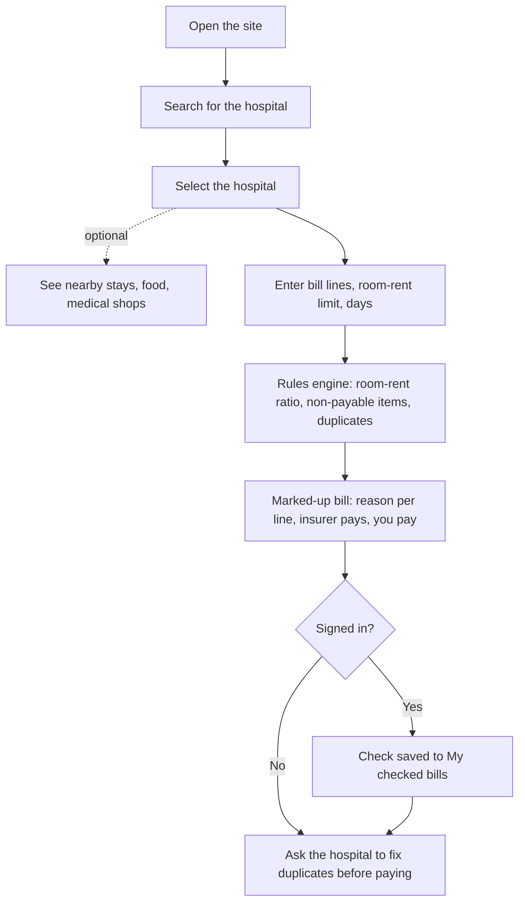
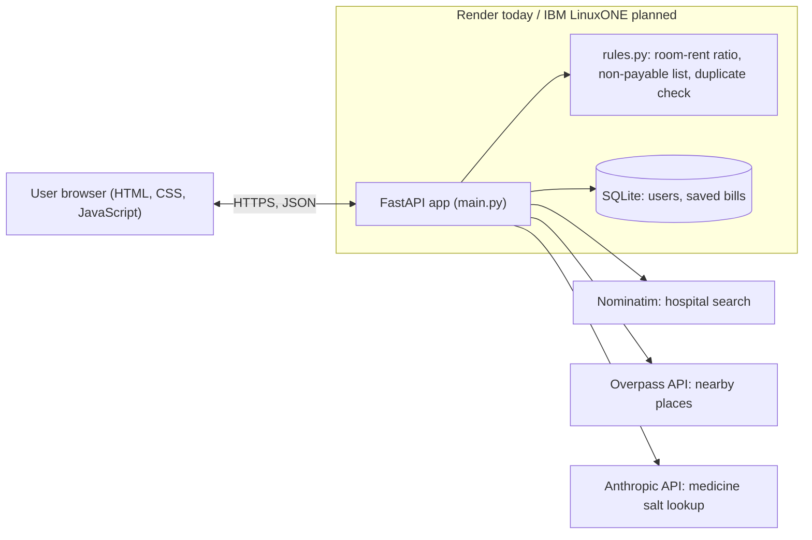

# Fineprint: flowchart and architecture

## Solution flowchart

```mermaid
flowchart TD
  A["Open the site"] --> B["Search for the hospital"]
  B --> C["Select the hospital"]
  C -.optional.-> N["See nearby stays, food, medical shops"]
  C --> D["Enter bill lines, room-rent limit, days"]
  D --> E["Rules engine: room-rent ratio, non-payable items, duplicates"]
  E --> F["Marked-up bill: reason per line, insurer pays, you pay"]
  F --> G{"Signed in?"}
  G -- Yes --> H["Check saved to My checked bills"]
  G -- No --> I["Ask the hospital to fix duplicates before paying"]
  H --> I
```

## System architecture

```mermaid
flowchart LR
  U["User browser (HTML, CSS, JavaScript)"] <-->|"HTTPS, JSON"| API
  subgraph HOST["Render today / IBM LinuxONE planned"]
    API["FastAPI app (main.py)"] --> R["rules.py: room-rent ratio, non-payable list, duplicate check"]
    API --> DB[("SQLite: users, saved bills")]
  end
  API --> NOM["Nominatim: hospital search"]
  API --> OVP["Overpass API: nearby places"]
  API --> AI["Anthropic API: medicine salt lookup"]
```

Map data (c) OpenStreetMap contributors.
